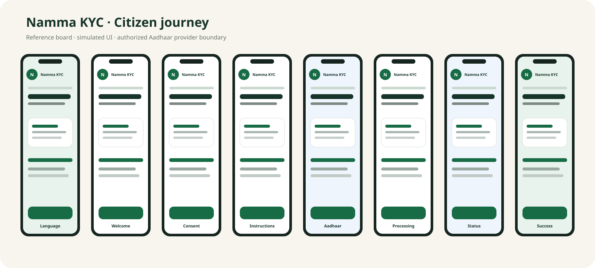

# Namma KYC citizen journey

Namma KYC is an independent open-source reference implementation. The screens below describe the intended citizen journey and the boundary between Namma KYC and authorized identity infrastructure.

> **Status:** design/reference documentation. This project is not an official Government of Karnataka, NIC, UIDAI, or PDS application unless formally authorized or adopted.

## Journey

1. Branded splash and language switch.
2. Welcome screen with Namma KYC, Karnataka visual identity, Vidhana Soudha and family artwork.
3. Ration-card number lookup.
4. Household members and current e-KYC state; members already verified recently are shown as completed and are not re-submitted.
5. Consent.
6. Aadhaar number and OTP verification.
7. Face preparation and authorized FaceRD handoff.
8. Aadhaar authentication result.
9. PDS e-KYC processing.
10. Completion and temporary status/reference.

## UI reference board

The design was developed from the high-resolution Namma KYC UI reference used during product design. The repository also contains an implementation of the same visual language in the Android app and the standalone browser demo.

The reference design uses a warm Karnataka-inspired cream/green system, clear cards, large touch targets, progress indicators, explicit consent, and strong provider-boundary messaging.

## Interactive demonstration

The standalone demo is in the demo directory and is intentionally disconnected from the Namma KYC API. It uses only fictional, preconfigured values.

When published with GitHub Pages, the expected project-site URL is:

https://bharathcoorg.github.io/nammakyc/

Do not present the demo URL as an official government service.

## Screenshot policy

Promotional or concept screenshots must be labeled as **reference/design** material. Any screen depicting a face scan must not imply that Namma KYC itself performs biometric recognition. Production biometric authentication belongs behind the authorized Aadhaar integration boundary.
